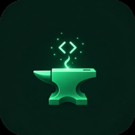
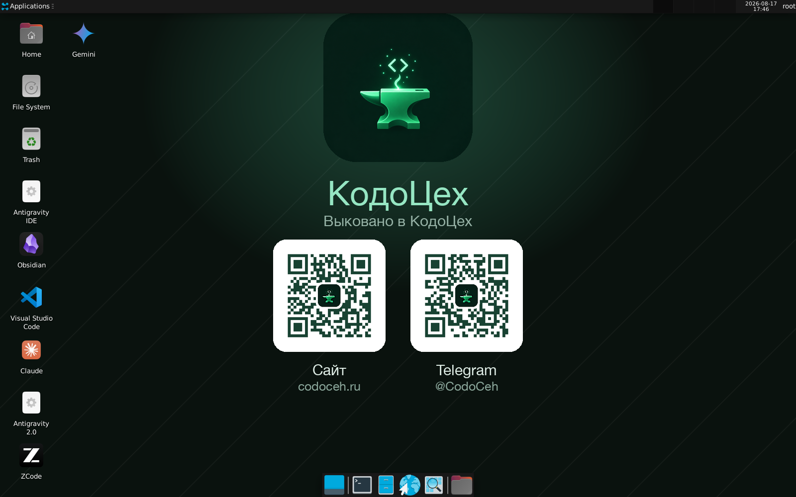
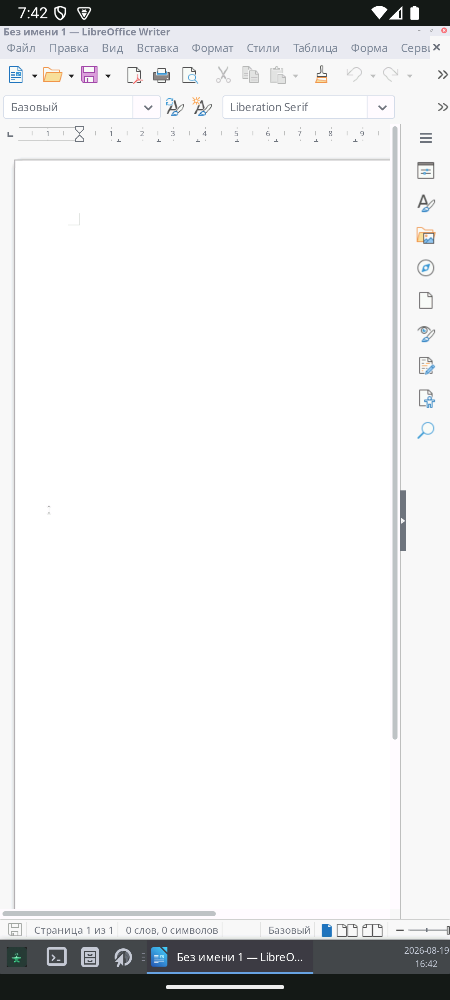

# КовКод

КовКод — Android-приложение, которое разворачивает полноценный Linux-рабочий стол на устройстве без root-прав. Проект рассчитан на тех, кому нужен мобильный компьютер для документов, разработки, браузера и повседневной работы, а не только эмулятор терминала.

## Что внутри

- рабочий стол XFCE;
- Chromium, LibreOffice Writer/Calc/Impress, Geany и файловый менеджер Thunar;
- каталог приложений для установки дополнительных программ по требованию;
- поддержка открытия файлов и обмена через Android;
- аппаратное ускорение для совместимых устройств с Adreno.

## Как это работает

В APK встроен подготовленный Linux-образ. После первого запуска он разворачивается в изолированном пользовательском пространстве Android через proot: разблокировка загрузчика и root-права не нужны. Приложение поднимает рабочий стол и подключает к нему Android-интерфейс.

## Требования

- Android 9 или новее;
- 64-битный ARM-процессор (`arm64`);
- не менее 5 ГБ свободного места;
- root-права не требуются.

## Установка

1. Скачайте актуальный APK в разделе [Releases](https://github.com/CodoCeh/kovkod/releases).
2. Разрешите установку приложений из этого источника в настройках Android.
3. Установите APK и откройте «КовКод».
4. При первом запуске дождитесь подготовки рабочего окружения.

## Ссылки

- Студия CodoCeh: [codoceh.ru](https://codoceh.ru)
- Загрузки: [Releases](https://github.com/CodoCeh/kovkod/releases)

## Статус исходного кода

Это публичная карточка продукта CodoCeh. Исходный код, инструменты сборки и внутренние образы здесь не публикуются. В Release размещается только готовый APK для установки.
