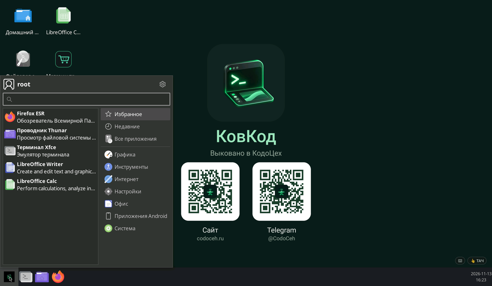
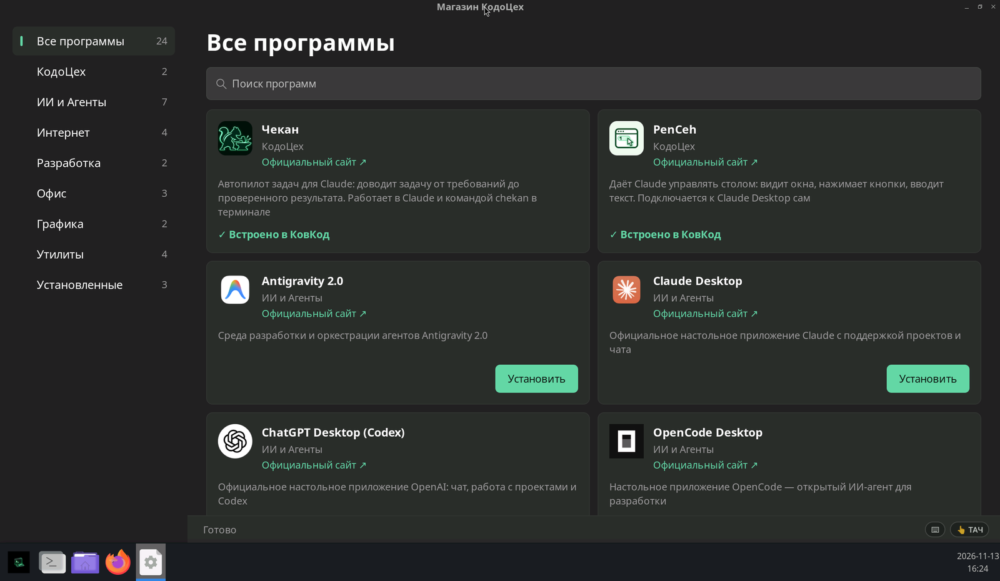
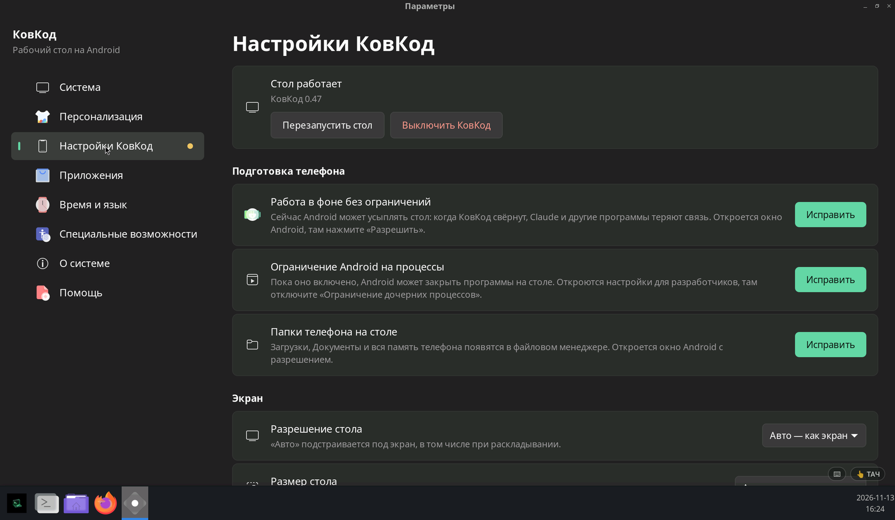
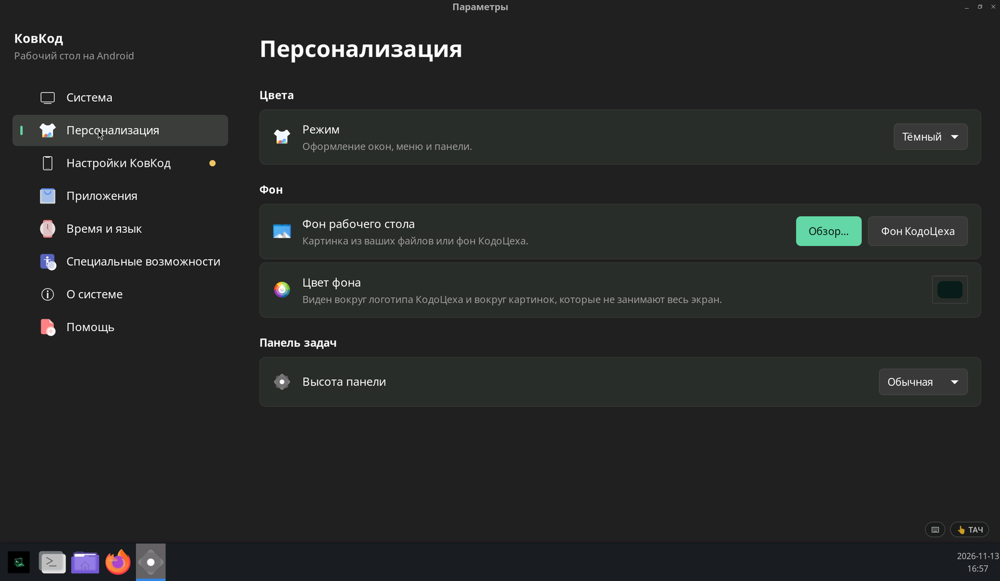
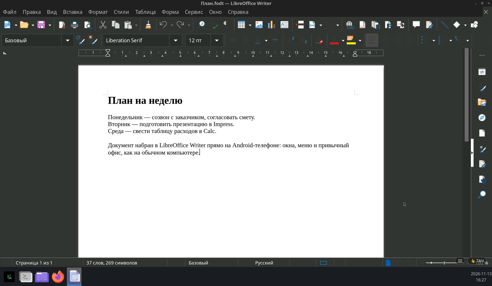
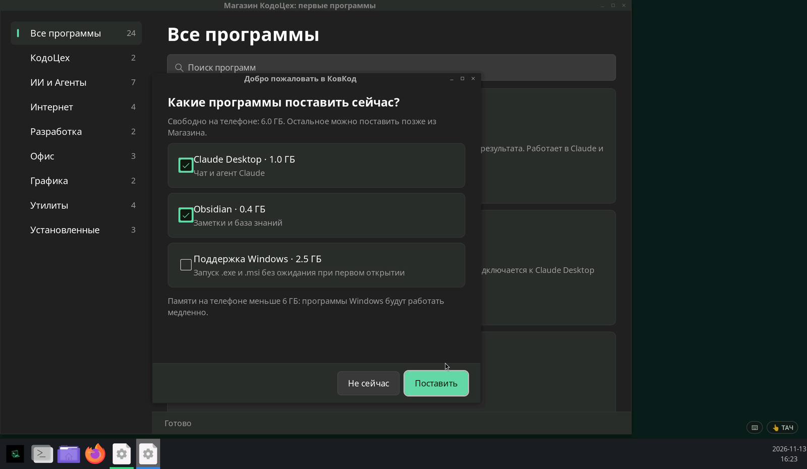
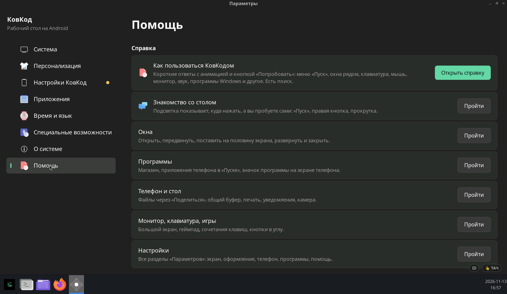
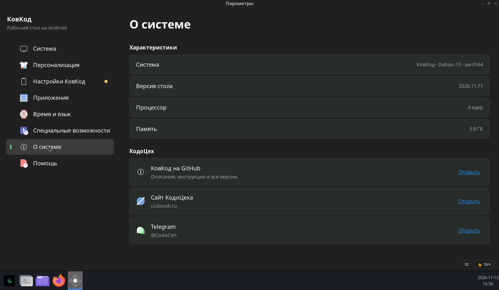

# КовКод

КовКод превращает Android-телефон в настоящий компьютер. Это одно приложение: вы ставите его, ждёте несколько минут, и на экране появляется рабочий стол с меню «Пуск», окнами, файлами и привычными программами. Root-права, разблокировка загрузчика и Termux не нужны.

**[Скачать КовКод 0.51 (APK, 483 МБ)](https://github.com/CodoCeh/kovkod/releases/download/v0.51/KovKod-0.51-arm64.apk)** · [все версии](https://github.com/CodoCeh/kovkod/releases)

## Зачем это нужно

Телефон сегодня мощнее многих ноутбуков, но работать на нём неудобно: нет окон, нормального браузера, офиса и программ для разработки. КовКод снимает это ограничение.

- **Нет ноутбука под рукой.** В поездке, на объекте или в командировке можно открыть документ, поправить таблицу, ответить на рабочую почту в полноценном браузере.
- **Хочется один телефон вместо двух устройств.** Подключите монитор, клавиатуру и мышь — телефон работает как настольный компьютер. Сам экран телефона при этом становится тачпадом.
- **Работа с ИИ-агентами в дороге.** Claude, Claude Code, VS Code и Obsidian работают на телефоне так же, как на компьютере. Агенты могут сами управлять окнами стола.
- **Студенты и те, у кого нет компьютера.** LibreOffice для рефератов и презентаций, браузер, редактор кода — бесплатно, на устройстве, которое уже есть.
- **Владельцы складных телефонов.** Большой экран Galaxy Fold наконец используется как экран компьютера.

## Что внутри

**Рабочий стол, похожий на Windows**
- меню «Пуск», панель задач, ярлыки на столе, светлая и тёмная тема;
- окна раскладываются на половину или четверть экрана и запоминают своё место;
- «Параметры» в одном окне: экран, оформление, программы, звук, разрешения телефона, помощь.

**Программы**
- сразу есть Firefox, LibreOffice (Writer, Calc, Impress), файловый менеджер и редактор кода;
- Магазин ставит ещё программы одним касанием: Claude, Visual Studio Code, Obsidian, RustDesk и другие;
- часть программ для Windows ставится и запускается двойным щелчком по `.exe`;
- приложения Android тоже открываются из меню «Пуск», а любую программу стола можно вынести значком на главный экран телефона.

**Связь с телефоном**
- папки телефона «Загрузки», «Документы» и другие видны на столе;
- файлы из любого приложения Android отправляются на стол через «Поделиться»;
- общий буфер обмена и уведомления телефона на столе;
- звук, микрофон и камера работают в программах стола.

**Управление**
- касание как мышь или как сенсорный экран, переключение одной кнопкой;
- экранная клавиатура, физическая клавиатура и мышь, геймпад;
- прокрутка двумя-тремя пальцами, увеличение щипком;
- внешний монитор, а телефон в это время — тачпад.

**Скорость**
- видеоускорение на телефонах с Adreno: окна и игры рисуются видеокартой, а не процессором;
- режимы экономии заряда и процессора.

**Забота о пользователе**
- при первом запуске знакомство показывает, куда нажимать, и помогает включить нужные разрешения, объясняя, зачем каждое;
- темы знакомства и справка с поиском всегда доступны в «Параметры» → «Помощь»;
- переезд на новый телефон по Wi-Fi или через файл: весь стол с файлами и входами в аккаунты или только настройки и программы.

## В комплекте

С КовКодом сразу идут два инструмента CodoCeh для работы с Claude. Отдельно их ставить не нужно, обновление КовКода обновляет и их.

- [PenCeh](https://github.com/CodoCeh/penceh) — управление компьютером для ИИ-агентов: Claude видит окна стола, нажимает кнопки и вводит текст. Подключается к Claude Desktop сам.
- [Чекан](https://github.com/CodoCeh/chekan) — команда агентов для Claude Code: от задачи до готового результата. Напишите в Claude «чекан, …», и команда возьмёт задачу. В терминале доступны команды `chekan` и `ч`.

## Требования

- Android 9 или новее;
- 64-битный ARM-процессор (`arm64`);
- не менее 5 ГБ свободного места.

## Установка

1. Скачайте [КовКод 0.51](https://github.com/CodoCeh/kovkod/releases/download/v0.51/KovKod-0.51-arm64.apk).
2. Разрешите установку приложений из этого источника в настройках Android.
3. Установите APK и откройте «КовКод».
4. При первом запуске дождитесь подготовки стола и пройдите короткое знакомство.

Обновления приходят внутри приложения: КовКод сам предложит новую версию.

## Как пользоваться

**Касания.** Короткое касание — щелчок мышью. Долгое касание — правая кнопка: меню окна, файла или стола. Значок на столе открывается двойным касанием, как на компьютере.

**Прокрутка и масштаб.** Ведите по экрану двумя или тремя пальцами — страница прокручивается. Разведите два пальца — стол увеличится, сведите — вернётся.

**Кнопки в углу экрана.** ⌨ открывает клавиатуру. «Тач / Мышь» переключает режим: в режиме «Мышь» палец двигает указатель, как по тачпаду.

**Программы.** Меню «Пуск» — в левом нижнем углу. Новые программы ставит «Магазин программ» на столе: найдите программу и нажмите «Установить».

**Файлы с телефона.** В любом приложении Android нажмите «Поделиться» → «Открыть на столе КовКод», и файл окажется на столе. Папки телефона «Загрузки» и «Документы» открываются в файловом менеджере слева.

**Настройки и помощь.** Всё настраивается в «Параметрах» — ярлык на столе. Там же раздел «Помощь»: справка с поиском и темы знакомства, которые можно пройти в любой момент.

**Новый телефон.** «Параметры» → «Настройки КовКод» → «Переезд на новый телефон»: стол переедет по Wi-Fi или через файл.

**Выход.** Значок «Выключить КовКод» на столе закрывает стол и все открытые программы.

## Ссылки

- Студия CodoCeh: [codoceh.ru](https://codoceh.ru)
- Telegram: [@CodoCeh](https://t.me/CodoCeh)
- Загрузки: [Releases](https://github.com/CodoCeh/kovkod/releases)

Ссылки на эту страницу, сайт и Telegram есть и в самом КовКоде: «Параметры» → «О системе».

## Статус исходного кода

Это публичная карточка продукта CodoCeh. Исходный код, инструменты сборки и внутренние образы здесь не публикуются. В Release размещается только готовый APK для установки.

Внутри приложения есть программы под GNU GPL: proot, talloc и система Debian. Их исходный код выдаём по запросу на [cebersdev@gmail.com](mailto:cebersdev@gmail.com), условия — на экране «О программе» в приложении. Исходный код программ Debian также лежит в архиве [sources.debian.org](https://sources.debian.org/).
